# Local LLM Decision Orchestrator: Job Hunting Season

> **Status:** MVP Validated (Local Execution)  
> **Role:** Research Pilot for [Physically-Aware Synthetic Surveillance Data]

## 🎯 Motivation
The primary motivation behind this project is to address the inefficiency of manually filtering noise from job descriptions in the job market.

In job hunting, one must sift through hundreds of job descriptions to find the few that match complex constraints (e.g., visa rules, tech stack compatibility, remote work policies). Traditional keyword search fails to capture these semantic nuances. For example, a position that requires computer vision experience could drown in the title "Machine Learning Engineer".

This project was built to validate that a **Local LLM Agent** can serve as an intelligent filter and planner, solving this "needle in a haystack" problem while preserving data privacy.

Crucially, this project also serves as the pilot for a research project: **Real-World Data-Driven Synthetic Surveillance Dataset Generation Pipeline**. 
By treating video generation models and task-specific LoRAs as "Agents," the future research aims to leverage this same agentic workflow to significantly improve efficiency and reduce computational costs in synthetic data generation.

## 📖 Introduction

This project implements a **Hybrid AI Agent** powered by Google Gemini API, designed to leverage extensive user context to identify job descriptions that best fit my expertise.

Unlike purely local solutions, this system utilizes the state-of-the-art reasoning capabilities and long-context window of Gemini models to analyze my full background: including technical skills, financial goals, and visa constraints. It acts as an intelligent orchestrator that filters noise and provides strategic application advice, while keeping the core document storage (CVs/Databases) managed locally.

## 🏗️ System Architecture

```mermaid
graph TD
    User[User / Researcher] -->|1. Input JD Batch| Agent["AI Agent Orchestrator<br/>(Google Gemini API)"]
    
    %% 資料庫與設定 (Local)
    subgraph "Local Knowledge Base"
        ConstraintDB[("User Profile DB<br/>(Visa, Tax, Salary)")]
        MasterCV[("Master CV Database<br/>(Projects & Skills)")]
    end

    %% 第一階段：過濾
    subgraph "Phase 1: Semantic Filtering (Hard Filters)"
        Agent <-->|API Call + Context| ConstraintDB
        Agent -->|Analyze| JDs[("Raw JD Files")]
        Agent -->|Reasoning| Decision{Pass Constraints?}
        Decision -- No --> Trash[Discard]
    end

    %% 第二階段：分析與建議
    subgraph "Phase 2: Contextual Analysis (Soft Matching)"
        Decision -- Yes --> Analyzer[Analysis Skill]
        Analyzer <-->|RAG Retrieval| MasterCV
        Analyzer -->|Map Experience| Context[Structured Insight]
    end

    %% 第三階段：輸出
    subgraph "Phase 3: Output & Review"
        Context -->|Drafting| Writer[Content Generator]
        Writer -->|Output| Report["Analysis Report &<br/>Draft Suggestions"]
        Report -->|Final Check| Human["User Review &<br/>Tailor Resume/CV"]
    end

    style Agent fill:#e3f2fd,stroke:#1565c0,stroke-width:2px,color:#000
    style ConstraintDB fill:#fff9c4,stroke:#fbc02d,stroke-width:2px,color:#000
    style MasterCV fill:#fff9c4,stroke:#fbc02d,stroke-width:2px,color:#000
    style Human fill:#e8f5e9,stroke:#2e7d32,stroke-width:2px,color:#000
```

## 🚀 Key Features
1.  **SOTA Semantic Filtering:**
    * Leverages Google Gemini's advanced reasoning to understand subtle nuances in JDs (e.g., distinguishing between "required" vs. "nice-to-have" skills, or detecting implicit visa restrictions).
2.  **Context-Aware Planning (RAG):**
    * Dynamically retrieves the most relevant project experiences from a local personal database based on the specific requirements of the target position.
3.  **Hybrid Efficiency:**
    * Combines the low latency of local vector stores (ChromaDB) with the high-throughput inference of the Gemini API, ensuring a balance between performance and cost.

## 🛠️ Tech Stack
* **Orchestration:** Python, Google Generative AI SDK (Gemini API)
* **Model:** Gemma-3-27b / Pro
* **Vector Store:** ChromaDB (Local Storage)
* **Environment:** Python 3.10+

---
*This project is part of a broader research initiative on Agentic AI workflows for Data Synthesis.*