# Local LLM Decision Orchestrator: Job Hunting Season

> **Status:** MVP Validated (Local Execution) <br>
> **Role:** Research Pilot for [Physically-Aware Synthetic Surveillance Data]

## 🎯 Motivation
The primary motivation behind this project is to address the inefficiency of manually filtering noise from job descriptions in the job market.

In job hunting, one must sift through hundreds of job descriptions to find the few that match complex constraints (e.g., visa rules, tech stack compatibility, remote work policies). Traditional keyword search fails to capture these semantic nuances. For example, a position that requires computer vision experience could drown in the title "Machine Learning Engineer".

This project was built to validate that a **Local LLM Agent** can serve as an intelligent filter and planner, solving this "needle in a haystack" problem while preserving data privacy.

Crucially, this project also serves as the pilot for a research project: **Real-World Data-Driven Synthetic Surveillance Dataset Generation Pipeline**.<br>
By treating video generation models and task-specific LoRAs as "Agents," the future research aims to leverage this same agentic workflow to significantly improve efficiency and reduce computational costs in synthetic data generation.

## 📖 Introduction

This project implements a **Hybrid AI Agent** powered by Google Gemini API, designed to leverage extensive user context to identify job descriptions that best fit my expertise.

Unlike purely local solutions, this system utilizes the state-of-the-art reasoning capabilities and long-context window of Gemini models to analyze my full background: including technical skills, financial goals, and visa constraints. It acts as an intelligent orchestrator that filters noise and provides strategic application advice, while keeping the core document storage (CVs/Databases) managed locally.


## 🏗️ System Architecture



## 🚀 Key Features
1.  **SOTA Semantic Filtering:**
    * Leverages **Google Gemini's** advanced reasoning to understand subtle nuances in JDs (e.g., distinguishing between "required" vs. "nice-to-have" skills), surpassing local models.
2.  **Multimodal Ingestion with Smart Caching:**
    * **Vision Capabilities:** Capable of processing **non-text inputs** (e.g., screenshots of job posts, scanned PDFs) using Gemini's vision model.
    * **Cost-Optimized:** Implements a **"Read-Once" policy**. Extracted text is automatically serialized and saved locally (`.txt`). Subsequent runs bypass the expensive vision inference step, retrieving the cached text instantly to reduce API costs and latency.
3.  **Context-Aware Planning (RAG):**
    * Dynamically retrieves the most relevant project experiences from a local personal database based on the specific requirements of the target position.
4.  **Hybrid Efficiency:**
    * Combines the low latency of local vector stores (ChromaDB) with the high-throughput inference of the Gemini API.

## 🛠️ Tech Stack
* **Orchestration:** Python, Google Generative AI SDK (Gemini API)
* **Model:** Gemma-3-27b / Pro
* **Vector Store:** ChromaDB (Using default `all-MiniLM-L6-v2` for local embeddings)
* **Environment:** Python 3.11

## 📂 Data Structure
The system automatically manages raw inputs and cached outputs:

```text
data/
├── chroma_db/            # chroma_database (embeddings from all-MiniLM-L6-v2, HNSW)
├── raw/                  # personal info
│   ├── personal_info_a.pdf
│   └── personal_info_b.pdf
├── jds/                  # Input: Raw files (PDFs, Images, Text)
│   ├── position_A.pdf
│   └── position_B.pdf
│   ├── position_A.txt    # OCR Result (Created once, reused forever)
│   └── position_B.txt    # Parsed Text
├── reports/              # Analyzed Reports
│   ├── report_A.md
│   └── report_b.md       
└─── history              # Past Applications
    ├── past_JD_a
    └── past_JD_b       
```

## 🔮 Future Roadmap: Closed-Loop Learning (V2.0)
Currently, the system acts as a static advisor. The V2.0 objective is to implement **Reinforcement Learning from Human Feedback (RLHF)** logic to turn the agent into a dynamic strategist that learns from market responses.

### The "War Room" Architecture
We plan to introduce a structured history module (`data/history/`) to track the lifecycle of every application:
1.  **Input:** Past applied JDs + The specific Resume/CV version used.
2.  **Labeling:** The outcome (e.g., `Auto-Reject`, `Interview`, `Offer`).

### Core V2.0 Capabilities
* **Strategic Back-Propagation:**
    * When analyzing a new JD, the agent queries the history database for semantically similar past roles.
    * *Logic:* "Warning! This position matches the profile of [Company X] where 'CV Version A' was rejected. Suggest pivoting to 'CV Version B' strategy, which secured an interview at [Company Y]."
* **Automated A/B Testing:**
    * Systematically tests different "Personas" (e.g., *Pure Researcher* vs. *Applied Engineer*) against different market sectors to identify optimal fit.
* **ATS Trap Detection:**
    * Identifies patterns in rejected applications (e.g., specific keywords causing auto-rejects) to flag potential ATS risks in future drafts.
    
---
*This project is part of a broader research initiative on Agentic AI workflows for Data Synthesis.*