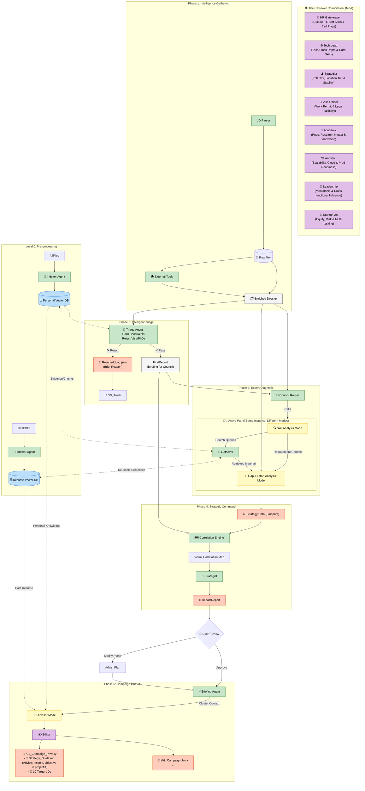

# Job Hunting Season 2: Agentic Career Orchestrator 
#### An ROI-Driven Multi-Agent System
**Not a ghostwriter, just an assistant and probably strategist**
> **Current Status:** v2 Released (Jan 2026) - Full Multi-Agent Pipeline Operational; v3 in dev.


## 🎯 Motivation

The primary motivation behind this project is to solve the extremely low signal-to-noise ratio in the current job market and the unsustainable time cost of high-quality applications.

In job hunting, one must sift through hundreds of job descriptions to find the few that match complex constraints (e.g., visa rules, tech stack compatibility, remote work policies). Traditional keyword search fails to capture these semantic nuances. For example, a position that requires computer vision experience could drown in the title "Machine Learning Engineer". Manually parsing hundreds of JDs to find the few that align with specific constraints (e.g., Privacy-Preserving AI, European Visa sponsorship) is an exhausting and inefficient process that drains cognitive resources.

Furthermore, effective job hunting requires more than just reading; it demands **verification** (checking market salary, validating research alignment), **reflection** (comparing against past applications to avoid repeated mistakes), and **strategic execution** (prioritizing high-ROI opportunities and allocating effort efficiently). 


This project is to build an ROI-Driven Agentic System that automates the "low-level filtering" and "strategic intelligence gathering." This ensures that the human candidate can allocate their limited bandwidth exclusively to high-leverage opportunities, shifting focus from searching to crafting the perfect application.


**Research Context:**  
This project also serves as the architectural pilot for **Real-World Data-Driven Synthetic Surveillance Dataset Generation Pipeline**. By treating video generation models and task-specific LoRAs as "Agents," the future research aims to leverage this same agentic workflow to significantly improve efficiency and reduce computational costs in synthetic data generation.

---

## 📖 Introduction

This project implements a Multi-Agent RAG Orchestrator with a dynamic Mixture-of-Advisors (MoA) pattern, where a Router Agent activates specialized LLM-based agents per JD and aggregates their assessments into strategic decisions. 

Unlike infra-level sparse Mixture-of-Agents (MoA) models with shared parameters inside a single network, each advisor here is an independent agent with its own prompt and memory, coordinated through orchestration rather than low-level model routing.

All core document storage (CVs, personal databases) remains **locally managed** via ChromaDB to maintain a structured local archive of user's career data, while the cloud API is used solely for reasoning tasks with sanitized inputs.

### 🚀 System Evolution

#### From v2 to v3
> Transition from a single‑node batch pipeline to a cloud‑ready, large‑scale parallel orchestration layer across AWS/GCP.

The v2 architecture already introduced a tiered Mixture‑of‑Advisors flow, but execution remained essentially single‑node and sequential. v3 reuses a single orchestration image across local and cloud runtimes, with phase-specific workers launched via different commands but governed by shared input/output schemas. Scalable intake(*data‑parallel intake workers (Phase 1-2)*) and expert-council reasoning(*planner‑plus‑parallel‑advisors council (Phase 3)*) run on AWS/GCP, while the resulting dossiers are synchronized back to the local environment for downstream clustering and execution planning.

#### From v1 to v2
> Transition from Mega-prompting to a orchastration framework with Mixture-of-Agents, enhancing Context-Awareness through Attention Partitioning while optimizing cost for both tokens and expensive LLM models.

The _naive PoC_, mega prompting, is essentially wasting tokens of advanced LLM models while risking attention dilution. Considering a larger scale of usage (particularly when applied to synthetic dataset generation), the system is decoupled into a **tiered inference**, **Multi-Agent** system where a Router Agent executes an OODA loop to ground strategic analysis in real-world technical signals. Eventually, the filtering phase of the **orchestration** system filtered out the JDs that dont fit the hard constraints, while the other JDs are analyzed by an **expert council with dynamic members** to provide feedback and suggestions accordingly.


#### ☁️ v3 (Ongoing): Time to Scale Up
<details>
    <summary>
     Cloud-Ready Large-Scale Parallel Processing (AWS / GCP)
    </summary>

- **Sequential-to-parallel expert execution**:
v2 already routes dossiers to relevant experts, but executes each expert call sequentially via per-expert loops; v3 upgrades this into parallelizable advisor jobs for scalable cloud execution. Decomposes Phase 3 into a planner → dual parallel fan-out → aggregator pipeline, where expert skill extraction and gap analysis are executed concurrently across the selected advisor set before being consolidated into a final council report.

- **Single-image, multi-role deployment**:
The orchestration framework is packaged as a reusable container image, where phase-specific roles are launched by overriding runtime commands rather than maintaining separate stacks.

- **Persistent council artifacts for downstream phases**
Instead of only mutating in-place dossier files, v3 formalizes council outputs as reusable artifacts that can be pulled back into local Phase 4/5 workflows.

- **Cloud execution templates for AWS/GCP**
v3 introduces cloud-ready command templates and deployment patterns so the same image can run on local machines, AWS, or GCP with shared schemas and phase boundaries.
</details>

#### 🧑‍⚖️ v2 (Current): Summon the Expert Council
<details>
    <summary>
    Observe, Orient, Decide, and Act: Decision orchestration with a dynamic MoA
    </summary>
This upgrade transforms the system from a passive analyzer to an active decision orchestrator, executing a 4-step OODA loop:

- **Reason (Dynamic Mixture-of-Advisors (MoA))**:  
  Introduces a Router Agent that dynamically assembles an Expert Council based on the JD's nature. For example, a "Senior Research Scientist" role triggers the Academic Analyst (evaluating research alignment) and the Engineering Lead (evaluating technical depth and team fit), while a startup role may additionally trigger the Startup Scout (equity/risk).

- **Perceive (Tool-Augmented)**:  
  Breaks the "internal bubble" by autonomously verifying salaries and retrieving relevant arXiv papers or team signals to ground analysis in external reality.

- **Plan (MoA Advisory Battle Plans)**:  
  Replaces generic feedback with concrete Battle Plans (e.g., "Fixing this self-supervised learning gap unlocks 15 positions"), aggregating multiple advisors’ perspectives into a single strategic recommendation rather than relying on a single all-purpose prompt.

- **Act (Hard Triage on Constraints)**:  
  Actively rejects non-viable roles (e.g., visa infeasibility, location/compensation mismatch, PhD relevance constraints) before they consume human attention or additional compute.
</details>

#### 🧩 v1 (Legacy): The Naive Way
<details>
    <summary>
 A Rigid "Smart Filter"
    </summary>

- **Fixed Linear Protocol**:<br> Processed data under a hard-coded procedure (Step A → B → C) regardless of the job context, lacking the autonomy to activate specific tools or skip unnecessary steps.
- **Isolated & Internal**: <br>Relied solely on local text comparison; blind to external market realities (e.g., actual salary data, active research groups).
- **Siloed Execution**: <br>Treated every JD as an independent event, lacking the ability to prioritize based on relative ROI.
</details>
   


---


## 🏗️ System Architecture


```mermaid
graph TD
    %% === 全域 Council 資源池 (MoA) ===
    subgraph Pool ["🏛️ The Reviewer Council Pool (MoA)"]
        direction LR
        E1["👔 HR Gatekeeper<br/>(Culture Fit, Soft Skills & Red Flags)"]:::council
        E2["⚙️ Tech Lead<br/>(Tech Stack Depth & Hard Skills)"]:::council
        E3["♟️ Strategist<br/>(ROI, Tax, Location Tier & Stability)"]:::council
        E4["🛂 Visa Officer<br/>(Work Permit & Legal Feasibility)"]:::council
        E5["🔬 Academic<br/>(Pubs, Research Impact & Innovation)"]:::council
        E6["🏗️ Architect<br/>(Scalability, Cloud & Prod-Readiness)"]:::council
        E7["🦁 Leadership<br/>(Mentorship & Cross-functional Influence)"]:::council
        E8["🚀 Startup Vet<br/>(Equity, Risk & Multi-tasking)"]:::council
    end
    
    %% === LEVEL 0: 履歷軍火庫 ===
    subgraph L0 ["Level 0: Pre-processing"]
        ResumeDB[("🗄️ Resume Vector DB")]:::db
        PersonalDB[("🗄️ Personal Vector DB")]:::db
        IndexerCV["🤖 Indexer Agent"]:::agent
        IndexerPK["🤖 Indexer Agent"]:::agent
        
        ResPDFs --> IndexerCV --> ResumeDB
        AllFiles --> IndexerPK --> PersonalDB


    end

    %% === Phase 1: 戰場情報 ===
    subgraph P1 ["Phase 1: Intelligence Gathering"]
        Parser["JD Parser"]:::agent --> RawText[("📄 Raw Text")]
        RawText --> Tools["🌍 External Tools"]:::agent
        RawText & Tools --> Dossier["🗂️ Enriched Dossier"]:::doc
    end

    %% === Phase 2: 檢傷分類 ===
    subgraph P2 ["Phase 2: Intelligent Triage"]
        Dossier --> Triage["🏥 Triage Agent <br/> Hard Constraints Check(Visa)"]:::agent
        PersonalDB -.-> Triage["🏥 Triage Agent <br/> Hard Constraints Reject(Visa/PhD)"]
     
        Triage -- "❌ Reject" --> RejectLog["📝 Rejected_Log.json<br/>(Brief Reason)"]:::output
        RejectLog --> Bin["📂 /99_Trash"]

        Triage -- "✅ Pass" --> FirstReport["FirstReport<br/>(Briefing for Council)"]:::doc
    end

    %% === Phase 3 流程 ===
    subgraph P3 ["Phase 3: Expert Diagnosis"]
        FirstReport --> Router["🔀 Council Router"]:::agent
        Dossier --> Router

        Router --> |"Calls"| ActivePanel
        
        subgraph ActivePanel ["🧑‍⚖️ Active Panel(Same Instance, Different Modes)"]
            direction TB
            Panel1["🔍 Skill Analysis Mode"]:::panel
            Panel2["🧠 Gap & Effort Analysis Mode"]:::panel
            Panel1 --> |"Search Queries"| Retriever["🤖 Retriever"]:::agent
            Panel1 --> |"Requirement Context"|Panel2
        end
        
        Dossier --> Panel2
        
        Retriever <-.-> |"Evidence/Chunks"| PersonalDB
        Retriever <-.-> |"Reusable Sentences"| ResumeDB
        Retriever --> |"Retrieved Material"| Panel2
    end

    %% === Phase 4: 戰略地圖 ===
    subgraph P4 ["Phase 4: Strategic Command"]
        Panel2 --> Out["📊 Strategy Data (Blueprint)"]:::output
        Out & FirstReport --> MapEngine["🗺️ Correlation Engine"]:::agent
        MapEngine --> VisualMap["Visual Correlation Map"]
        VisualMap --> TheGeneral["👮 Strategist"]:::agent
        TheGeneral --> BattlePlan["📊 ImpactReport"]:::output
    end

    %% === Human Loop ===
    BattlePlan --> UserCheck{"👤 User Review"}
    UserCheck -- "Approve" --> BriefingAgent["⚡ Briefing Agent"]:::agent

    UserCheck -- "Modify / Veto" --> Refine["Adjust Plan"]
    Refine --> BriefingAgent

    %% === Phase 5: 戰術執行 ===
    subgraph P5 ["Phase 5: Campaign Output"]
    Editor["👨‍🔬 Editor<br/>(Orgainize Suggestions, Conflict Resolution)"]:::council

        BriefingAgent -->|"Cluster Context"| Panel3["👨‍🔬 Advisor Mode"]:::panel
        PersonalDB -.->|"Personal Knowledge"| Panel3["👨‍🔬 Advisor Mode"]:::panel
        ResumeDB -.->|"Past Resume"| Panel3["👨‍🔬 Advisor Mode"]:::panel
        
        Panel3["👨‍🔬 Advisor Mode"] --> Editor["✍️ Editor"]:::council

        Editor --> OutputA["📂 /01_Campaign_Privacy<br/>- 📄 Strategy_Guide.md (Advice: Insert X objective in project A)<br/>- 📂 10 Target JDs"]:::output
        Editor --> OutputB["📂 /02_Campaign_Infra<br/>..."]:::output
    end

    %% === 樣式定義 (跨模式相容) ===
    classDef council fill:#e1bee7,stroke:#4a148c,color:#000;
    classDef panel fill:#fff9c4,stroke:#fbc02d,color:#000;
    classDef agent fill:#c8e6c9,stroke:#2e7d32,color:#000;
    classDef db fill:#bbdefb,stroke:#1565c0,color:#000;
    classDef doc fill:#f5f5f5,stroke:#616161,color:#000;
    classDef output fill:#ffccbc,stroke:#d84315,color:#000;
``` 


## 🚀 Key Features
#### 1. The Arsenal: Semantic Resume Indexing (Level 0)
   * **Pre-processing Agent:** An asynchronous `Indexer Agent` breaks down the user's Master CV and Papers into semantic fragments tagged by attributes (e.g., `#Privacy`, `#ComputerVision`, `#Leadership`).
   * **Vector-Based Retrieval:** Uses **ChromaDB** to retrieve only the relevant "skills blocks" needed for a specific JD, preventing context window pollution with irrelevant experiences.

#### 2. Tool-Augmented Intelligence (Phase 1)
   * **External Grounding:** The system actively gathers external context to "comprehend" the JD before analysis.
   * **Active Tools:**
      - **Salary Validator:** Queries external sources (mock Levels.fyi/Glassdoor) to verify if the ROI justifies the effort.
      - **Team Investigation:** Searches arXiv/Google Scholar to verify if the hiring team is scientifically active.

#### 3. Intelligent Triage & Gatekeeping (Phase 2)
   * **Hard Constraints Check:** A strict "Gatekeeper Agent" enforces physical survival constraints first.
   * **Filtering Logic:** Automatically rejects roles based on **Visa Sponsorship** feasibility (EU Work Permit), **PhD Relevance**, and **Expertise mis-Matched** constraints.
   * **Impact:** Reduces compute costs and cognitive load by ensuring only "playable" opportunities enter the analysis pipeline.
   * **Implementation Status**: Implemented as ``TriageAgent`` in ``src/phases/p2_triage.py``. Each dossier is enriched with a structured triage_result block (e.g., ``decision``, ``reason``, ``domain_mismatch``), and only dossiers that pass this gate are moved into the pending_council queue for downstream MoA routing.

#### 4. Dynamic Mixture-of-Agents (Phase 3)
- **Router-Based Diagnosis**: Instead of a single generic "Analysis Prompt", a Router Agent activates a small set of specialized reviewers based on the JD's domain and seniority. Example of the Council Members:
  - **Academic Analyst**: For research‑heavy roles (e.g., Research Scientist; focus: publication track record, topic alignment, lab/team fit).
  - **Engineering Lead**: For ML/Software roles (focus: deployment readiness, C++/systems skills, production constraints).
  - **Startup Scout**: For early‑stage companies (focus: equity vs. cash trade‑offs, runway, product risk, role ambiguity).

- **Benefit**: Produces domain‑specific, role‑aware gap analysis instead of generic career advice, by routing each JD to the most relevant advisors rather than treating all roles with a single monolithic prompt.

- **New Implementation**: 
  - **Core System**: Implemented as a single-pass council. For each JD, the Router selects specialized advisors and calls each exactly once, storing their scores and rationales back into the dossier. No multi-round debate at this stage due to API cost.
  - **User Profile Integration**: ✅ User Profile Integration: Phase 3 and Phase 5 can optionally use user_profile.json (manual or auto-generated) for faster context retrieval, with automatic fallback to ChromaDB if unavailable; significantly reducing large-model API calls.

Architecturally this behaves like a Mixture‑of‑Advisors (MoA) in a multi‑agent system, not an infra‑level sparse MoE model.

        
#### 5. Strategic Clustering (Phase 4 - The War Room)
   * **Adaptive DBSCAN Engine:** Uses semantically-aware density clustering (e.g., HDBSCAN) to group jobs based on text embedding similarity. The hyperparameters are selected automatically (knee point) that dynamically calculates the optimal `eps` distance, ensuring clusters are tight and meaningful without manual guessing.
    * **Flavor Extraction:** Summarize the common skill domain of each cluster (e.g., *"Cluster 0: GenAI Security"*, *"Cluster 1: ML Infrastructure"*) by analyzing common keywords in the vector space.
    * **Battle Plan Generation:** Outputs a structured JSON map (`battle_plan.json`) ranking clusters by **ROI Score** (Cluster Size × Average Match Score), separating high-value targets from "Noise" (outliers).


#### 6. Advisory Briefing Agent (Phase 5)

Phase 5 is not just an advisor; it is the **Chief Editor**. It synthesizes the "Expert Demands" (from Phase 3) with the "Candidate's Ammo" (Resume Database) to generate structured execution guidance.

- **Structured Action Plans:** Instead of a fixed-length list, the Editor generates a dynamic, exhaustive list of directives to cover ALL expert demands and showcase relevant experience:
  - **REUSE:** Identifies perfect matches in the existing resume bullets.
  - **TWEAK:** Suggests specific keyword modifications (e.g., "Change 'Cloud' to 'AWS EKS'") into existing bullets.
  - **NEW:** Proposes brand-new "Gap Filler" bullets using transferable skills (STAR format).
  - **LETTER:** Recommends narrative angles for the Cover Letter.

- **Conflict Resolution Core:** Applies a strict "Editor-in-Chief" philosophy (e.g., Technical Depth > HR Fluff, Safety > Risk) to resolve conflicting advice from different experts.

- **Role:** Acts as a strategic **assistant** (not a ghostwriter), helping candidates efficiently locate and organize relevant experience through structured action items.

## ⚡ Quick Start & Setup

### 1. Environment Configuration (`.env`)
Create a `.env` file in the root directory. This is crucial for linking your local files (e.g., Google Drive) to the Docker container. (refer to .env_example)

### 2. Directory Setup
Refer to [Data Structure](#-data-structure)

### 3. Launch the System
Start the Docker container in detached mode:
```bash
docker-compose up -d --build
```

4. Memory Injection (Initialization)

    **Step 1**: <br>Run these once initially, or whenever you update your Resume/AboutMe.md.
    * Ingest Personal Knowledge (Identity):<br> ```docker-compose run --rm orchestrator python src/ingests/personal_data.py``` <br> Reads ```data/raw/AboutMe.md``` and whatever files in ```data/raw/``` to build the agent's core understanding of YOU.
    * **[Optional] User Profile Acceleration:**
        * Option A (Manual): Use NotebookLLM to generate a structured profile from your ``AboutMe.md``:
            - Save it as `src/raw/user_profile.json`.
            - This acts as a "cheat sheet" for Phase 3 and Phase 5, avoiding ChromaDB queries
            - *Purpose:* NotebookLLM excels at handling long-context windows, producing a holistic "Meta-Summary" of your career that standard chunk-based RAG might miss.
        * Option B (Auto): If you skip this step, the system will automatically generate ``auto_generated_user_profile.json`` from your raw data during ingestion
        * Fallback: If neither exists, the system will query ChromaDB on-the-fly (slower but functional)
    * Ingest Battle History (Experience):<br> ```docker-compose run --rm orchestrator python src/ingests/resume_history.py``` <br> Scans your ```LOCAL_PATH_TO_...``` folders to index past applications for the "War Room" recall feature.

    **Step 2**: The Hunt <br>(v2 pipeline - Phase 1-3 are currently run via phase scripts, `main.py` remains v1 legacy)
    * Feed: Drop new JD PDFs (or images) into ```data/jds/```.
    * Phase 1-3 (current v2 workflow):  
        * _Run the phase scripts explicitly (until they are fully integrated into `src/main.py` in a later update)._  
            ```bash            
            # Phase 1: Tool-augmented JD parsing
            docker-compose run --rm orchestrator python src/phases/p1_scout.py
            --test-limit (number of testing JDs); --force-update (force update dossier); --max-workers (parallel workers)

            # Phase 2: Triage & Gatekeeping
            docker-compose run --rm orchestrator python src/phases/p2_triage.py

            # Phase 3: MoA Council (dynamic advisors)
            docker-compose run --rm orchestrator python src/phases/p3_council.py

            # Phase 4: Strategic Clustering & ROI Ranking
            docker-compose run --rm orchestrator python src/phases/p4_strategy.py

            # Phase 5: War Room Editor (Execution Plans)
            docker-compose run --rm orchestrator python src/phases/p5_advisor.py
            ```
    * Review Outputs: 
        - Phase 1 Output: ```data/processed/dossiers/``` - Parsed JD dossiers with intelligence reports
        - Phase 2 Output: ```data/processed/pending_council/``` - Triaged JDs that passed gatekeeping
        - Phase 3 Output: ```data/processed/pending_council/``` - Enriched with MoA expert analysis
        - Phase 4 Output: ```data/processed/battle_plan/```final_battle_plan.json - Clustered jobs with ROI scores
        - Phase 5 Output: ```data/processed/editor_reports/``` - Structured action plans per job (Markdown tables)
    * Workflow Tips:
        - Run Phase 1-3 sequentially for new JD batches
        - Run Phase 4 when you want to prioritize by ROI (e.g., weekly review)
        - Run Phase 5 interactively: it shows clusters and lets you select which one to generate plans for

    **Step 3**: Post-Battle Maintenance<br> When you receive an outcome (Reject/Interview):
    * Move the JD folder from Ongoing to Rejected (on your local drive).
    * Add an ```result.txt``` or ```reject_letter.txt``` inside the folder.
    * Run Ingest History again to update the agent's memory:<br>```docker-compose run --rm orchestrator python src/ingest_history.py```

## 🛠️ Tech Stack
* **Orchestration:** Python, Google Generative AI SDK (Gemini API)
* **Hybrid Model Architecture (Smart Gateway):**
    * **Logic & Extraction:** Gemma-3-27b-it (Larger Quota)
    * **Long-Context Retrieval:** Gemini-2.5-Flash (High TPM, Daily Limit Optimized)
    * **Reliability:** Pydantic for Structured Output enforcement (JSON Schema Validation) 🛡️
* **Vector Store:** ChromaDB (Using default `all-MiniLM-L6-v2` for local embeddings)
* **Environment:** Python 3.11 / Docker


## 📂 Data Structure
The system automatically manages raw inputs and cached outputs:

```text
data/
├── chroma_db/                              # Vector Database (User Profile & History Index)
├── raw/                                    # Personal Knowledge Base
│   ├── AboutMe.md                          # Dynamic User Values (Money, Visa, Location)
│   ├── user_profile.json                   # NotebookLLM-based resume
│   ├── auto_generated_user_profile.json    # [Auto]
│   ...                                     # Other files to be considered
├── jds/                                    # Input: New JDs to Analyze
│   ├── position_A.pdf
│   └── position_A.txt                      # Cached OCR/Text Result
├── reports/                                # Output: Analysis Reports
│   ├── Analysis_A.md
│   └── Strategic_Leaderboard.csv      
└── history/                                # Historical Battle Data
    ├── ongoing/                            # Active Applications
    └── rejected/                           # Past Failures (For Post-Mortem Recall)
```

## 🔮 Future Roadmap: Automated Optimization (v4.0)
Currently, the system serves as an intelligent advisor that *recalls* history. The v4.0 objective is to implement **Reinforcement Learning (RL)** logic to let the agent *learn* from history independently.

### Planned Capabilities
* **Global Trend Analysis (Beyond One-to-One):**
    * Instead of just recalling a specific past job, the agent will analyze aggregate data (e.g., "You have an 85% rejection rate when applying to 'FinTech' roles with 'CV Version B'. Stop doing that.")
* **Automated A/B Testing:**
    * Systematically generates two different "Persona Pitches" for similar roles, tracks the callback rate, and automatically updates the `Master CV` strategy weights based on the winner.
* **ATS Trap Detection:**
    * Reverse-engineers the "Black Box" of ATS systems by identifying common keyword patterns in `Auto-Reject` outcomes across different companies.
    
---
*This project is part of a broader research initiative on Agentic AI workflows for Data Synthesis.*