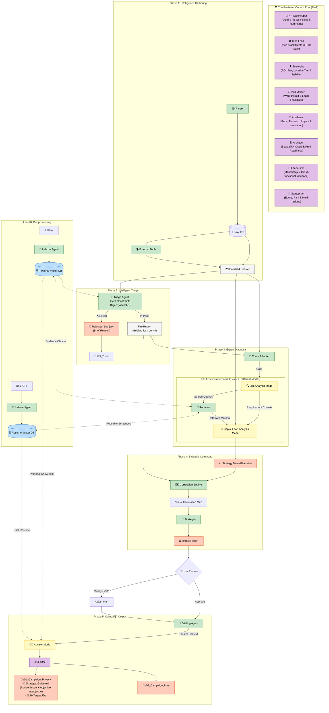

# Job Hunting Season 3.0: Agentic Career Orchestrator 
#### An ROI-Driven Multi-Agent System
**Not a ghostwriter, just an assistant and probably strategist**
> **Current Status:** v2 Released (Jan 2026) - Full Multi-Agent Pipeline Operational; v3 completed (parallel and AWS).


## 🎯 Motivation

**The Meta-Goal: An Architectural Pilot for Autonomous Systems**
While this project functions as a personal career tool, its core motivation lies in **research infrastructure**. Extending from my previous research in surveillance and privacy-preserving AI, I aim to build a **synthetic data generation pipeline** to tackle one of the greatest bottlenecks in domain development. By treating video generation models and task-specific LoRAs as "Agents," this research aims to leverage this same agentic workflow to significantly improve efficiency and reduce computational costs in the audio-visual domain.

This repository serves as an **architectural pilot**. By building a production-ready, local-first orchestrator to solve a tangible, real-world problem (my own job search), I am stress-testing the exact multi-agent patterns, parallel execution models, and context-injection pipelines needed for my future synthetic data research workflows.

**The Immediate Problem: The Low-Signal Job Market**
Applied locally, this system solves a brutal bottleneck: the modern job hunt has an extremely low signal-to-noise ratio. Candidates must screen hundreds of job descriptions under hard constraints (visa feasibility, specific tech stacks, compensation, location strategy). Traditional keyword search fails to capture these semantic nuances, and manual reading does not scale.

High-quality applications require deep research, external verification, and strategic gap analysis. This system automates the low-leverage execution: JD parsing, hard-constraint triage, and multi-perspective advisor analysis, freeing the human to focus purely on the high-leverage decisions: strategic effort allocation and final tailoring.

---

## 📖 Introduction

This project implements a a local-first multi-agent orchestration system for job-description analysis and application strategy. It combines structured dossier generation, rule-based triage, retrieval-backed user context, and a Router-driven **Mixture-of-Advisors** workflow that assigns each viable JD to a small set of specialized reviewers for skill and gap analysis.

Unlike infra-level sparse Mixture-of-Agents (MoA) models with shared parameters inside a single network, eaach advisor is not a separately fine-tuned model. Instead, the system reuses the same underlying LLM through separate API calls, while varying the advisor persona, evaluation philosophy, few-shot examples, and injected, isolated context. This creates a lightweight orchestration-level Mixture-of-Advisors pattern without maintaining multiple model weights.

In v3, the same orchestration image can run parallelly, either locally or in cloud environments(AWS), with local-first data management and optional S3-backed synchronization for scalable batch execution. 

### 🚀 System Evolution

#### From v2 to v3
> _Transition from a single-node batch pipeline to a cloud-ready, large-scale parallel orchestration layer across AWS/GCP._

The v2 architecture already introduced a tiered Mixture-of-Advisors flow, but execution remained essentially single-node and sequential. v3 reuses a single orchestration image across local and cloud runtimes, with phase-specific workers launched via different commands but governed by shared input/output schemas. Scalable reasoning phases: *data-parallel intake workers (Phase 1-2)* and *expert-level parallel council (Phase 3)*, can run concurrently on AWS/GCP, while the resulting dossiers are synchronized back to the local environment for downstream clustering, ROI ranking, and execution planning.

#### From v1 to v2
> _Transition from Mega-prompting to an orchestration framework with Mixture-of-Advisors, enhancing context-awareness through attention partitioning while optimizing token costs._

The *naive PoC* (v1) relied on mega-prompting, which inherently wasted tokens of advanced LLM models and risked severe attention dilution when processing lengthy constraints. Anticipating a larger scale of usage, particularly for future applications in synthetic dataset generation, the system was decoupled into a **tiered, multi-agent orchestration**. 

Instead of a single massive prompt, the system now utilizes an OODA-inspired loop: a Router Agent first grounds strategic analysis in real-world technical signals; the Triage phase rigidly filters out JDs that fail hard physical constraints (e.g., visa sponsorship); and finally, surviving JDs are routed to an **expert council with dynamic members**. This allows each selected advisor to evaluate the opportunity strictly within their designated domain, providing highly focused and actionable feedback.

#### ☁️ v3 (Ongoing): Time to Scale Up
<details>
    <summary>
     Cloud-Ready Large-Scale Parallel Processing (AWS Native)
    </summary>

- **Sequential-to-parallel expert execution**:
v2 already routes dossiers to relevant experts, but executes each expert call sequentially via per-expert loops. v3 upgrades this into parallelizable advisor jobs for scalable cloud execution. It decomposes Phase 3 into a planner → dual parallel fan-out → aggregator pipeline, where expert skill extraction and gap analysis are executed concurrently across the selected advisor set before being consolidated into a final council report.

- **Single-image, multi-role deployment**:
The orchestration framework is packaged as a reusable container image, where phase-specific roles are launched by overriding runtime commands rather than maintaining separate stacks.

- **Persistent council artifacts for downstream phases**:
Instead of only mutating in-place dossier files, v3 formalizes council outputs as reusable artifacts that can be safely written to object storage (S3) and later pulled back into local Phase 4/5 workflows.

- **Cloud execution templates for AWS**:
v3 introduces cloud-ready command templates and IAM deployment patterns so the exact same image can run seamlessly on local machines or AWS ECS/Fargate with shared schemas and phase boundaries. (GCP support is planned but not yet validated).
</details>

#### 🧑‍⚖️ v2 (Current): Summon the Expert Council
<details>
    <summary>
    Observe, Orient, Decide, and Act: Decision orchestration with a dynamic MoA
    </summary>
This upgrade transforms the system from a passive analyzer to an active decision orchestrator, executing an OODA-inspired loop:

- **Reason (Dynamic Mixture-of-Advisors (MoA))**:  
  Introduces a Router Agent that dynamically assembles an Expert Council based on the JD's nature. For example, a "Senior Research Scientist" role triggers the Academic Analyst (evaluating research alignment) and the Engineering Lead (evaluating technical depth and team fit), while a startup role may additionally trigger the Startup Scout (equity/risk).

- **Perceive (Tool-Augmented)**:  
  Breaks the "internal bubble" by autonomously verifying salaries and retrieving relevant arXiv papers or team signals to ground analysis in external reality.

- **Plan (MoA Advisory Battle Plans)**:  
  Replaces generic feedback with concrete Battle Plans (e.g., "Fixing this self-supervised learning gap unlocks 15 positions"), aggregating multiple advisors’ perspectives into a single strategic recommendation rather than relying on a single all-purpose prompt.

- **Act (Hard Triage on Constraints)**:  
  Actively rejects non-viable roles (e.g., visa infeasibility, location/compensation mismatch, PhD relevance constraints) before they consume human attention or additional compute.
</details>

#### 🧩 v1 (Legacy): The Naive Way
<details>
    <summary>
 A Rigid "Smart Filter"
    </summary>

- **Fixed Linear Protocol**:<br> Processed data under a hard-coded procedure (Step A → B → C) regardless of the job context, lacking the autonomy to activate specific tools or skip unnecessary steps.
- **Isolated & Internal**: <br>Relied solely on local text comparison; blind to external market realities (e.g., actual salary data, active research groups).
- **Siloed Execution**: <br>Treated every JD as an independent event, lacking the ability to prioritize based on relative ROI.
</details>
---

## 🏗️ System Architecture


```mermaid
graph TD
    %% === 全域 Council 資源池 (MoA) ===
    subgraph Pool ["🏛️ The Reviewer Council Pool (MoA)"]
        direction LR
        E1["👔 HR Gatekeeper<br/>(Culture Fit, Soft Skills & Red Flags)"]:::council
        E2["⚙️ Tech Lead<br/>(Tech Stack Depth & Hard Skills)"]:::council
        E3["♟️ Strategist<br/>(ROI, Tax, Location Tier & Stability)"]:::council
        E4["🛂 Visa Officer<br/>(Work Permit & Legal Feasibility)"]:::council
        E5["🔬 Academic<br/>(Pubs, Research Impact & Innovation)"]:::council
        E6["🏗️ Architect<br/>(Scalability, Cloud & Prod-Readiness)"]:::council
        E7["🦁 Leadership<br/>(Mentorship & Cross-functional Influence)"]:::council
        E8["🚀 Startup Vet<br/>(Equity, Risk & Multi-tasking)"]:::council
    end
    
    %% === LEVEL 0: 履歷軍火庫 ===
    subgraph L0 ["Level 0: Pre-processing"]
        ResumeDB[("🗄️ Resume Vector DB")]:::db
        PersonalDB[("🗄️ Personal Vector DB")]:::db
        IndexerCV["🤖 Indexer Agent"]:::agent
        IndexerPK["🤖 Indexer Agent"]:::agent
        
        ResPDFs --> IndexerCV --> ResumeDB
        AllFiles --> IndexerPK --> PersonalDB


    end

    %% === Phase 1: 戰場情報 ===
    subgraph P1 ["Phase 1: Intelligence Gathering"]
        Parser["JD Parser"]:::agent --> RawText[("📄 Raw Text")]
        RawText --> Tools["🌍 External Tools"]:::agent
        RawText & Tools --> Dossier["🗂️ Enriched Dossier"]:::doc
    end

    %% === Phase 2: 檢傷分類 ===
    subgraph P2 ["Phase 2: Intelligent Triage"]
        Dossier --> Triage["🏥 Triage Agent <br/> Hard Constraints Check(Visa)"]:::agent
        PersonalDB -.-> Triage["🏥 Triage Agent <br/> Hard Constraints Reject(Visa/PhD)"]
     
        Triage -- "❌ Reject" --> RejectLog["📝 Rejected_Log.json<br/>(Brief Reason)"]:::output
        RejectLog --> Bin["📂 /99_Trash"]

        Triage -- "✅ Pass" --> FirstReport["FirstReport<br/>(Briefing for Council)"]:::doc
    end

    %% === Phase 3 流程 ===
    subgraph P3 ["Phase 3: Expert Diagnosis"]
        FirstReport --> Router["🔀 Council Router"]:::agent
        Dossier --> Router

        Router --> |"Calls"| ActivePanel
        
        subgraph ActivePanel ["🧑‍⚖️ Active Panel(Same Instance, Different Modes)"]
            direction TB
            Panel1["🔍 Skill Analysis Mode"]:::panel
            Panel2["🧠 Gap & Effort Analysis Mode"]:::panel
            Panel1 --> |"Search Queries"| Retriever["🤖 Retriever"]:::agent
            Panel1 --> |"Requirement Context"|Panel2
        end
        
        Dossier --> Panel2
        
        Retriever <-.-> |"Evidence/Chunks"| PersonalDB
        Retriever <-.-> |"Reusable Sentences"| ResumeDB
        Retriever --> |"Retrieved Material"| Panel2
    end

    %% === Phase 4: 戰略地圖 ===
    subgraph P4 ["Phase 4: Strategic Command"]
        Panel2 --> Out["📊 Strategy Data (Blueprint)"]:::output
        Out & FirstReport --> MapEngine["🗺️ Correlation Engine"]:::agent
        MapEngine --> VisualMap["Visual Correlation Map"]
        VisualMap --> TheGeneral["👮 Strategist"]:::agent
        TheGeneral --> BattlePlan["📊 ImpactReport"]:::output
    end

    %% === Human Loop ===
    BattlePlan --> UserCheck{"👤 User Review"}
    UserCheck -- "Approve" --> BriefingAgent["⚡ Briefing Agent"]:::agent

    UserCheck -- "Modify / Veto" --> Refine["Adjust Plan"]
    Refine --> BriefingAgent

    %% === Phase 5: 戰術執行 ===
    subgraph P5 ["Phase 5: Campaign Output"]
    Editor["👨‍🔬 Editor<br/>(Orgainize Suggestions, Conflict Resolution)"]:::council

        BriefingAgent -->|"Cluster Context"| Panel3["👨‍🔬 Advisor Mode"]:::panel
        PersonalDB -.->|"Personal Knowledge"| Panel3["👨‍🔬 Advisor Mode"]:::panel
        ResumeDB -.->|"Past Resume"| Panel3["👨‍🔬 Advisor Mode"]:::panel
        
        Panel3["👨‍🔬 Advisor Mode"] --> Editor["✍️ Editor"]:::council

        Editor --> OutputA["📂 /01_Campaign_Privacy<br/>- 📄 Strategy_Guide.md (Advice: Insert X objective in project A)<br/>- 📂 10 Target JDs"]:::output
        Editor --> OutputB["📂 /02_Campaign_Infra<br/>..."]:::output
    end

    %% === 樣式定義 (跨模式相容) ===
    classDef council fill:#e1bee7,stroke:#4a148c,color:#000;
    classDef panel fill:#fff9c4,stroke:#fbc02d,color:#000;
    classDef agent fill:#c8e6c9,stroke:#2e7d32,color:#000;
    classDef db fill:#bbdefb,stroke:#1565c0,color:#000;
    classDef doc fill:#f5f5f5,stroke:#616161,color:#000;
    classDef output fill:#ffccbc,stroke:#d84315,color:#000;
``` 


## 🚀 Key Features

#### 1. The Arsenal: Semantic Resume Indexing (Level 0)
   * **Pre-processing Agent:** An asynchronous `Indexer Agent` breaks down the user's Master CV and publications into semantic fragments tagged by attributes (e.g., `#Privacy`, `#ComputerVision`, `#Leadership`).
   * **Vector-Based Retrieval:** Uses **ChromaDB** to retrieve only the relevant "skills blocks" needed for a specific JD, preventing context window pollution with irrelevant experiences.

#### 2. Tool-Augmented Intelligence (Phase 1)
   * **External Grounding:** The system actively gathers external context to "comprehend" the JD before analysis.
   * **Active Tools:**
      - **Salary Validator:** Queries external sources (mock Levels.fyi/Glassdoor) to verify if the ROI justifies the effort.
      - **Team Investigation:** Searches arXiv/Google Scholar to verify if the hiring team is scientifically active. 
   * **Data-Parallel Intake:** Since context gathering for each JD is independent, this phase is fully data-parallel. It scales efficiently via local thread pools or horizontally across AWS/GCP task definitions.

#### 3. Intelligent Triage & Gatekeeping (Phase 2)
   * **Hard Constraints Check:** A strict "Gatekeeper Agent" enforces physical survival constraints first.
   * **Filtering Logic:** Automatically rejects roles based on **Visa Sponsorship** feasibility (e.g., EU Work Permit), **PhD Relevance**, and **Expertise Mismatch**.
   * **Impact:** Reduces compute costs and cognitive load by ensuring only "playable" opportunities enter the expensive reasoning pipeline.
   * **Implementation:** Implemented as `TriageAgent`. Each dossier is enriched with a structured `triage_result` block (e.g., `decision`, `reason`, `domain_mismatch`). Only dossiers passing this gate proceed to the `pending_council` queue.
   * **Data-Parallel Routing:** Like Phase 1, triage evaluations are independent per JD and execute concurrently, maximizing throughput for large batches.

#### 4. Dynamic Mixture-of-Advisors (Phase 3)
- **Router-Based Diagnosis**: Instead of a single generic "Analysis Prompt", a Router Agent activates a small set of specialized reviewers based on the JD's domain and seniority. Example Council Members:
  - **Academic Analyst**: For research-heavy roles (focus: publication track record, topic alignment, lab/team fit).
  - **Engineering Lead**: For ML/Software roles (focus: deployment readiness, C++/systems skills, production constraints).
  - **Startup Scout**: For early-stage companies (focus: equity vs. cash trade-offs, runway, product risk, role ambiguity).
  > *Architectural Note:* This behaves as an orchestration-level Mixture-of-Advisors (MoA). It produces domain-specific, role-aware gap analysis by routing each JD to the most relevant advisors, instantiated via separate API calls rather than treating all roles with a single monolithic prompt.
- **Expert-Level Parallelism:** Within a single JD dossier, the Router concurrently dispatches the selected advisors. The council aggregation waits only on the slowest expert, effectively reducing per-JD latency from $O(k \cdot t_{expert})$ to $O(\max_k \cdot t_{expert})$.
- **Profile Acceleration**: Phase 3 (and Phase 5) optionally utilize a structured `user_profile.json` (auto-generated via NotebookLLM) for rapid context injection, falling back to ChromaDB chunk retrieval only when necessary. This significantly reduces large-model API costs.

#### 5. Strategic Clustering (Phase 4 - The War Room)
   * **Adaptive DBSCAN Engine:** Uses semantically-aware density clustering (HDBSCAN) to group jobs based on text embedding similarity. Hyperparameters are selected automatically via knee-point detection to dynamically calculate the optimal `eps` distance, ensuring tight clusters without manual guessing.
   * **Flavor Extraction:** Summarizes the common skill domain of each cluster (e.g., *"Cluster 0: GenAI Security"*, *"Cluster 1: ML Infrastructure"*) by analyzing keyword centroids in the vector space.
   * **Battle Plan Generation:** Outputs a structured JSON map (`battle_plan.json`) ranking clusters by **ROI Score** (Cluster Size × Average Match Score), cleanly separating high-value targets from outlier noise.

#### 6. Advisory Briefing Agent (Phase 5)
Phase 5 is not just another advisor; it is the **Chief Editor**. It synthesizes the "Expert Demands" (from Phase 3) with the "Candidate's Ammo" (Resume Database) to generate structured execution guidance.

- **Structured Action Plans:** Instead of a generic checklist, the Editor generates a dynamic, exhaustive list of directives to cover all expert demands:
  - **REUSE:** Identifies perfect matches in existing resume bullets.
  - **TWEAK:** Suggests specific keyword modifications (e.g., "Change 'Cloud' to 'AWS EKS'") for existing bullets.
  - **NEW:** Proposes brand-new "Gap Filler" bullets using transferable skills (STAR format).
  - **LETTER:** Recommends narrative angles for the Cover Letter.
- **Conflict Resolution Core:** Applies a strict "Editor-in-Chief" philosophy (e.g., Technical Depth > HR Fluff, Safety > Risk) to resolve conflicting advice from different Phase 3 experts.
- **Role:** Acts as a strategic **assistant** (not a ghostwriter), helping candidates efficiently locate and organize relevant experience.

## 🛠️ Tech Stack
* **Core Orchestration:** Python 3.11, Docker, Google Generative AI SDK
* **Hybrid Inference Architecture (Smart Gateway):**
    * **Simplier Tasks:** `Gemma-3-27b-it` (Larger Quota) for deep reasoning and expert council analysis.
    * **Long-Context:** `Gemini-2.5-Flash` (Daily Limit Optimized) for processing large dossiers and context ingestion.
    * **Reliability Layer:** `Pydantic` for strict Structured Output enforcement (JSON Schema validation). 🛡️
* **Data & State Management:** 
    * **Semantic Embeddings:** `gemini-embedding-001` (via Google Generative AI API) for text vectorization and dual-weighted feature mixing (Must-Haves vs. Nice-to-Haves).
    * **Semantic Clustering (Phase 4):** `scikit-learn` (`HDBSCAN`, `DBSCAN`, `AgglomerativeClustering`) for dynamic, density-based grouping of job opportunities.
    * **Local Context Retrieval:** `ChromaDB` for local resume and publication vector storage.
    * **Cloud State (v3):** AWS S3 for parallel batch execution state synchronization.
* **Execution Environment:** 
    * **Local:** Docker Compose (Local-first processing & interactive editing).
    * **Cloud:** AWS ECS/Fargate (Scalable data-parallel tasks).


## ⚡ Quick Start & Setup

### 1. Environment Configuration (`.env`)
Create a `.env` file in the root directory. This is crucial for linking your local files (e.g., Google Drive) to the Docker container. (refer to .env_example)

### 2. Directory Setup
Refer to [Data Structure](#-data-structure)

### 3. Launch the System
Start the Docker container in detached mode:
```bash
docker-compose up -d --build
```

4. Memory Injection (Initialization)

    **Step 1**: <br>Run these once initially, or whenever you update your Resume/AboutMe.md.
    * Ingest Personal Knowledge (Identity):<br> ```docker-compose run --rm orchestrator python src/ingests/personal_data.py``` <br> Reads ```data/raw/AboutMe.md``` and whatever files in ```data/raw/``` to build the agent's core understanding of YOU.
    * **[Optional] User Profile Acceleration:**
        * Option A (Manual): Use NotebookLLM to generate a structured profile from your ``AboutMe.md``:
            - Save it as `src/raw/user_profile.json`.
            - This acts as a "cheat sheet" for Phase 3 and Phase 5, avoiding ChromaDB queries
            - *Purpose:* NotebookLLM excels at handling long-context windows, producing a holistic "Meta-Summary" of your career that standard chunk-based RAG might miss.
        * Option B (Auto): If you skip this step, the system will automatically generate ``auto_generated_user_profile.json`` from your raw data during ingestion
        * Fallback: If neither exists, the system will query ChromaDB on-the-fly (slower but functional)
    * Ingest Battle History (Experience):<br> ```docker-compose run --rm orchestrator python src/ingests/resume_history.py``` <br> Scans your ```LOCAL_PATH_TO_...``` folders to index past applications for the "War Room" recall feature.

    **Step 2**: The Hunt
    * Feed: Drop new JD PDFs (or images) into ```data/jds/```.
    * Phase 1-3 (current v2 workflow):  
        * _Run the phase scripts explicitly_  
            ```bash            
            # Phase 1: Tool-augmented JD parsing
            docker-compose run --rm orchestrator python src/phases/p1_scout.py
            --test-limit (number of testing JDs); --force-update (force update dossier); --max-workers (parallel workers)
            
            # Phase 2: Triage & Gatekeeping
            docker-compose run --rm orchestrator python src/phases/p2_triage.py
            same options as p1
            
            # Phase 3: MoA Council (dynamic advisors)
            docker-compose run --rm orchestrator python src/phases/p3_council.py

            # Phase 4: Strategic Clustering & ROI Ranking
            docker-compose run --rm orchestrator python src/phases/p4_strategy.py

            # Phase 5: War Room Editor (Execution Plans)
            docker-compose run --rm orchestrator python src/phases/p5_advisor.py
            ```
    * Review Outputs: 
        - Phase 1 Output: ```data/processed/dossiers/``` - Parsed JD dossiers with intelligence reports
        - Phase 2 Output: ```data/processed/pending_council/``` - Triaged JDs that passed gatekeeping
        - Phase 3 Output: ```data/processed/pending_council/``` - Enriched with MoA expert analysis
        - Phase 4 Output: ```data/processed/battle_plan/```final_battle_plan.json - Clustered jobs with ROI scores
        - Phase 5 Output: ```data/processed/editor_reports/``` - Structured action plans per job (Markdown tables)
    * Workflow Tips:
        - Run Phase 1-3 sequentially for new JD batches
        - Run Phase 4 when you want to prioritize by ROI (e.g., weekly review)
        - Run Phase 5 interactively: it shows clusters and lets you select which one to generate plans for

    **Step 3**: Post-Battle Maintenance<br> When you receive an outcome (Reject/Interview):
    * Move the JD folder from Ongoing to Rejected (on your local drive).
    * Add an ```result.txt``` or ```reject_letter.txt``` inside the folder.
    * Run Ingest History again to update the agent's memory:<br>```docker-compose run --rm orchestrator python src/ingest_history.py```

## 🛠️ Tech Stack
* **Orchestration:** Python, Google Generative AI SDK (Gemini API)
* **Hybrid Model Architecture (Smart Gateway):**
    * **Logic & Extraction:** Gemma-3-27b-it (Larger Quota)
    * **Long-Context Retrieval:** Gemini-2.5-Flash (Daily Limit Optimized)
    * **Reliability:** Pydantic for Structured Output enforcement (JSON Schema Validation) 🛡️
* **Vector Store:** ChromaDB (Using default `all-MiniLM-L6-v2` for local embeddings)
* **Environment:** Python 3.11 / Docker


## 📂 Data Structure
The system automatically manages raw inputs and cached outputs:

```text
data/
├── chroma_db/                              # Vector Database (User Profile & History Index)
├── raw/                                    # Personal Knowledge Base
│   ├── AboutMe.md                          # Dynamic User Values (Money, Visa, Location)
│   ├── user_profile.json                   # NotebookLLM-based resume
│   ├── auto_generated_user_profile.json    # [Auto]
│   ...                                     # Other files to be considered
├── jds/                                    # Input: New JDs to Analyze
│   ├── position_A.pdf
│   └── position_A.txt                      # Cached OCR/Text Result
├── reports/                                # Output: Analysis Reports
│   ├── Analysis_A.md
│   └── Strategic_Leaderboard.csv      
└── history/                                # Historical Battle Data
    ├── ongoing/                            # Active Applications
    └── rejected/                           # Past Failures (For Post-Mortem Recall)
```

## 🔮 Future Roadmap: Automated Optimization (v4.0)
Currently, the system serves as an intelligent advisor that *recalls* history. The v4.0 objective is to implement **Reinforcement Learning (RL)** logic to let the agent *learn* from history independently.

### Planned Capabilities
* **Global Trend Analysis (Beyond One-to-One):**
    * Instead of just recalling a specific past job, the agent will analyze aggregate data (e.g., "You have an 85% rejection rate when applying to 'FinTech' roles with 'CV Version B'. Stop doing that.")
* **Automated A/B Testing:**
    * Systematically generates two different "Persona Pitches" for similar roles, tracks the callback rate, and automatically updates the `Master CV` strategy weights based on the winner.
* **ATS Trap Detection:**
    * Reverse-engineers the "Black Box" of ATS systems by identifying common keyword patterns in `Auto-Reject` outcomes across different companies.
    
---
*This project is part of a broader research initiative on Agentic AI workflows for Data Synthesis.*